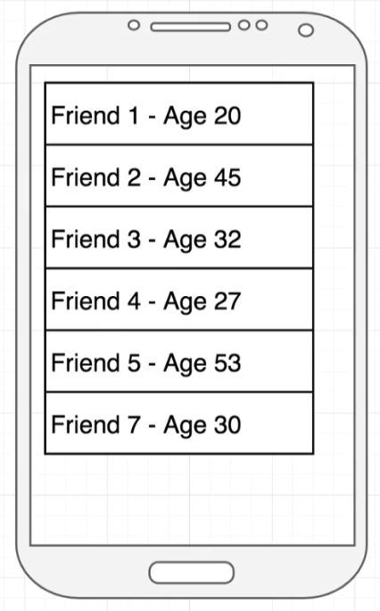

# List Building With Style

- [Introduction](#introduction)
- [The FlatList element](#the-flatlist-element)
- [Why set a key property?](#why-set-a-key-property)
- [Solving the key issue](#solving-the-key-issue)
- [Props around FlatList](#props-around-flatlist)
- [Exercise](#exercise)
- [Reference](#reference)

## Introduction

This lesson will show how to build lists using the `FlatList` element. Check [ListScreen.js](./src/screens/ListScreen.js) to more detail.
## The FlatList element

- Turns an array into a list of elements
- We are required to pass in a `prop` of `data` - the array of dta that we are going to create a bunch of elements out of
- Also required to pass in a `renderItem` prop - function that will turn each individual item into an element
- If you are coming from React on the web, you might be used to `mapping` an array of data to build a list. FlatList is better with React Native

## Why set a key property?

If we modify the list, for example, deleting one element. 

React will update elements when we have a key for each element. The key values must be unique in the entire array.

## Solving the key issue

The first way is set the key property to the original object as shown in [ListScreenKeyManually.js](./src/screens/ListScreenKeyManually.js).

The second way is using the `keyExtractor` prop of `FlatList` as seen in [ListScreenKeyExtractor.js](./src/screens/ListScreenKeyExtractor.js).
## Props around FlatList

In [ListScreenStyled.js](./src/screens/ListScreenStyled.js) we are using some properties to change the look and feel of the `FlatList` component. The first property is `horizontal` that changes the redering direction. And the second property used was `showsHorizontalScrollIndicator`, which allows to hide the horizontal scroll bar.

## Exercise

1. Create a new `FlatList` component with these specs:
    - Make the `FlatList` scroll vertically again
    - Add a new `age` property to each of our `friend` objects
    - Print out that age for each element produced by the `FlatList`

Use the reference below:

## Reference

- [FlatList documentation](https://reactnative.dev/docs/flatlist)

