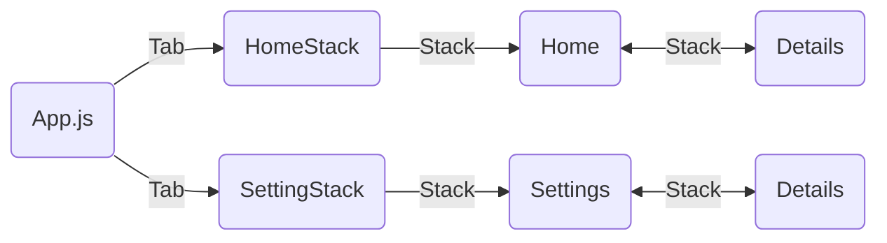

# Navegação por pilha em cada aba

- [Introdução](#introdução)
- [Uma pilha de navegação para cada aba](#uma-pilha-de-navegação-para-cada-aba)
- [Exercício](#exercício)
- [Referências](#referências)

## Introdução

Neste projeto analisaremos o uso de vários componentes de navegação de forma aninhada.

## Uma pilha de navegação para cada aba

## Exercício

## Referências

- [Navegação por pilha em cada aba](https://reactnavigation.org/docs/tab-based-navigation#a-stack-navigator-for-each-tab)