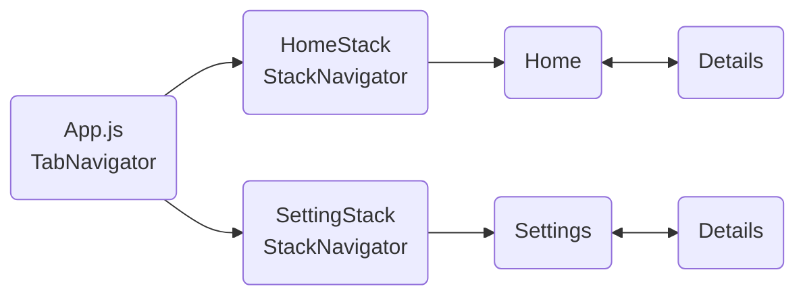

# Navegação por pilha em cada aba

- [Introdução](#introdução)
- [Uma pilha de navegação para cada aba](#uma-pilha-de-navegação-para-cada-aba)
- [Exercício](#exercício)
- [Referências](#referências)

## Introdução

Neste projeto analisaremos o uso de vários componentes de navegação de forma aninhada.

## Uma pilha de navegação para cada aba

Nós podemos configurar esquemas de navegação mais complexos. Neste projeto temos um esquema de navegação por abas definido na função principal do arquivo [App.js](./App.js#L10) que aponta para dois componentes. Esses componentes possuem o mapeamento em forma de pilha para outros dois componentes: [HomeStackScreen](./src/screens/HomeStackScreen.js) e [SettingsStackScreen](./src/screens/SettingsStackScreen.js).

Finalmente, esses componentes de mapeamento apontam para as suas respectivas telas. Note que a tela [DetailsScreen](./src/screens/DetailsScreen.js) é referenciada por ambos componentes de mapeamento. Durante a execução, eles são instanciados de forma independente como objetos distintos.

A estrutura de navegação deste projeto é ilustrado no diagrama a seguir:

## Exercício

Desenvolva um projeto de acordo com o esquema de navegação mostrado na figura a seguir:

## Referências

- [Navegação por pilha em cada aba](https://reactnavigation.org/docs/tab-based-navigation#a-stack-navigator-for-each-tab)