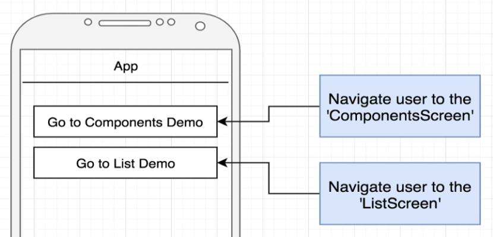
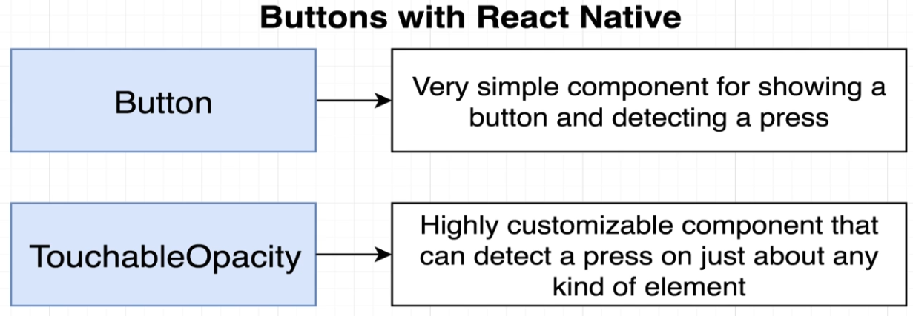
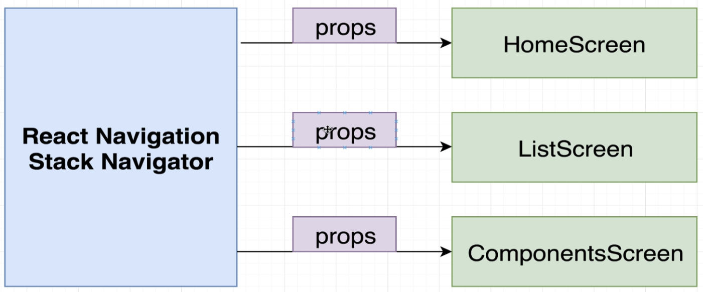
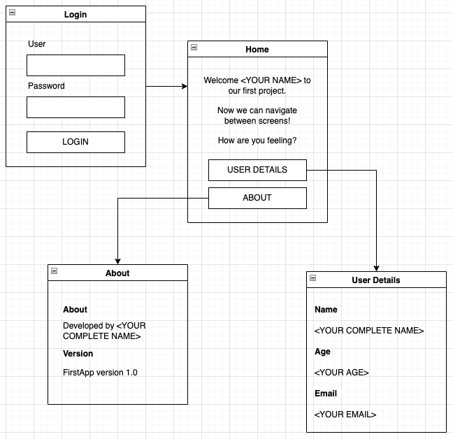

# Navigation Between Screens

- [Introduction](#introduction)
- [Project description](#project-description)
- [Button types](#button-types)
- [Button in action](#button-in-action)
- [TouchableOpacity in action](#touchableopacity-in-action)
- [Navigating with React Navigation](#navigating-with-react-navigation)
- [Exercise](#exercise)

## Introduction

In this lesson we will learn how to navigate between screens.

## Project description

In this project we have the main screen called Home Screen which will have two buttons. Each button will change the navigation to different screen as shown in image bellow:

## Button types

In React Native we can use two different types of button.

`Button` is the simplier component that allows developers to configure a clickable button. But the `TouchableOpacity` allow us to configure any clickable area inside this component.

In next sections we will use each button type to compare the complexity and how customizable are they.

## Button in action

We will use a `Button` component representing the first element in the [Home](src/screens/HomeScreen.js) screen.
Remember the `Button` component is a self closing element and the button text could be assigned by the `title` prop. Also, the press action could be handled by `onPress` prop.

## TouchableOpacity in action

The `TouchableOpacity` is a component that identifies pressing actions for the inner elements. So it's not a self closing element. That's the reason we defined it as a highly customizable component, we can use our creativity to create custom pressable components. 

## Navigating with React Navigation

According to image bellow, we need to create a `Stack Navigator` object which can pass props to the screens.

It can be configured in [App.js](App.js) inside the `<NavigationContainer>` element. We created the `Stack` const and inside `<NavigationContainer>`, we added each screen reference using the `<Stack.Screen>` element.

You can use the `initialRouteName` prop of the `Stack.Navigator` element to set up the main screen of your application.

The `HomeScreen` function contains a new argument related to that `prop` received from navigation.

## Exercise

Create a new project with 4 screens:

- Login 
- Home
- User Details
- About

The main screen should be the Login screen and the image bellow shows the mockup of this project with navigation details:

Styling your screens is strongly recommended to improve the user interface.

## Reference

- [Button documentation](https://reactnative.dev/docs/button)
- [TouchableOpacity documentation](https://reactnative.dev/docs/touchableopacity)
- [React Navigation component](https://reactnavigation.org/docs/getting-started)
