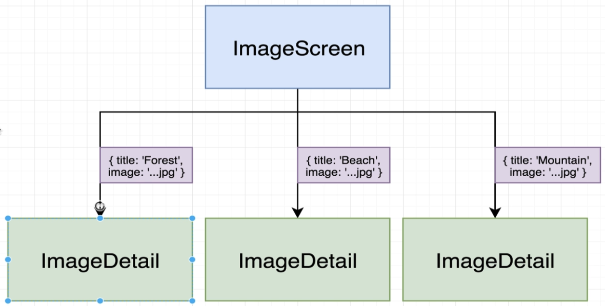
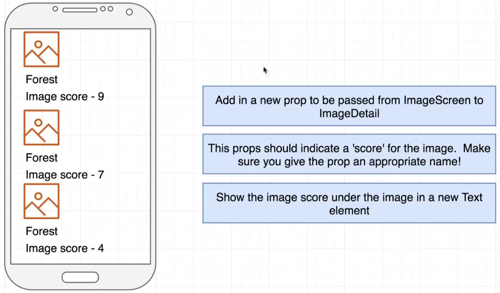

# Building Reusable Components
[](./README.md)
[](./README-en.md)

- [Introduction](#introduction)
- [Component reuse with props](#component-reuse-with-props)
- [Parent-Child relationships](#parent-child-relationships)
- [Communication from Parent to Child](#communication-from-parent-to-child)
- [Images](#images)
- [Showing images](#showing-images)
- [Passing images as props](#passing-images-as-props)
- [Exercise](#exercise)


## Introduction

In this lesson we will learn how to create reusable components. Sometimes we want to use the same component in different places of our project. In this case we can repeat a lot of code or create a single reusable component.

So we will learn how to build a component, communicate from parent to child element and pass parameters as props.

## Component reuse with props

We are trying to use best practices to reuse the same block of code as components. 

This repo will sove the problem below. We have a component called that shows an image and a title.


We can solve this scenario working on two different approaches:
- Same group of elements, repeating the same JSX three times over
- Create a separated component

So we will create a shared `ImageDetail` component with `title` and `image` props.



## Parent-Child relationships

The reusable components could be created inside [src/components](src/components/) directory. The idea is create a single component that could reused in any screen. We have the [ImageDetail.js](src/components/ImageDetail.js) file inside this folder. This is our component. 

Now we are able to use it in any place of our project. The first thing to do is import the component on the top of the file where we want to use it. We can check this import in [ImageScreen.js](src/screens/ImageScreen.js) file.

## Communication from Parent to Child

Now we can start passing parameters from Parent to Child using props. In `Parent` component, we can declare the props as a tag attribute. In `Child` component we can get all props on the first component argument function. 

This is an example:

- Parent:
```js
<ImageDetail title="Mountain"/>
```

- Child:
```js
const ImageDetail = (props) => {
    return <Text>{props.title}</Text>
}
```

In this case `Parent` is passing `title` as a prop and `Child` is receiving all props in `props` argument.

## Images

In this project we are using the images stored in [assets/img](assets/img) folder. Is a best practice keep all static files inside an `assets` folder in our projects.

## Showing images

To show images inside our `ImageDetail` component, we will use the React Native [Image](https://reactnative.dev/docs/image) component.

This component have the `source` prop that needs a image reference. We can load a static image reference of our project using the `require` function:

```js
const localImage = require('../../assets/img/beach.jpg')
return <Image source={localImage} style={styles.thumbImage} />
```

Also, we need to set up the image dimensions in `style` prop. It will be something like this:

```js
const styles = StyleSheet.create({
    thumbImage: {
        width: 50,
        height: 50
    }
})
```

Now we are able to pass the images name as a prop and render inside `ImageDetail` component.

## Passing images as props

In [ImageScreen](src/screens/ImageScreen.js) we have the `imageSources` array which have all images references that we want to render in [ImageDetail](src/components/ImageDetail.js) component.

We created the `imageSource` prop to pass to `ImageDetail` component. And finally, `ImageDetail` component use this prop as a source to React Native `Image` component.

## Exercise

Modify the current project to render the `score` prop in `ImageDetail` component.

