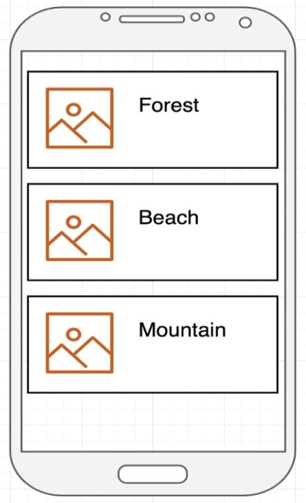
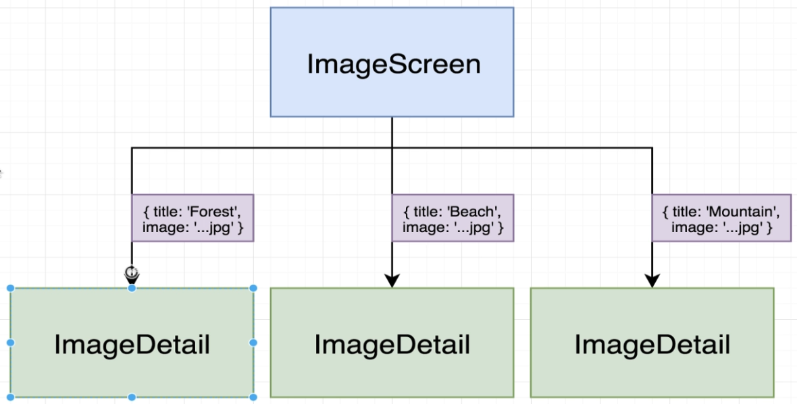

# Building Reusable Components

- [Introduction](#introduction)
- [Component reuse with props](#component-reuse-with-props)
- [Parent-child relationships](#parent-child-relationships)

## Introduction

In this lesson we will learn how to create reusable components. Sometimes we want to use the same component in different places of our project. In this case we can repeat a lot of code or create a single reusable component.

So we will learn how to build a component, communicate from parent to child element and pass parameters as props.

## Component reuse with props

We are trying to use best practices to reuse the same block of code as components. 

This repo will sove the problem bellow. We have a component called that shows an image and a title.

We can solve this scenario working on two different approaches:
- Same group of elements, repeating the same JSX three times over
- Create a separated component

So we can create a shared `ImageDetail` component with `title` and `image` props.

## Parent-child relationships

The reusable components could be created inside [src/components](src/components/) directory. The idea is create a single component that could reused in any screen.