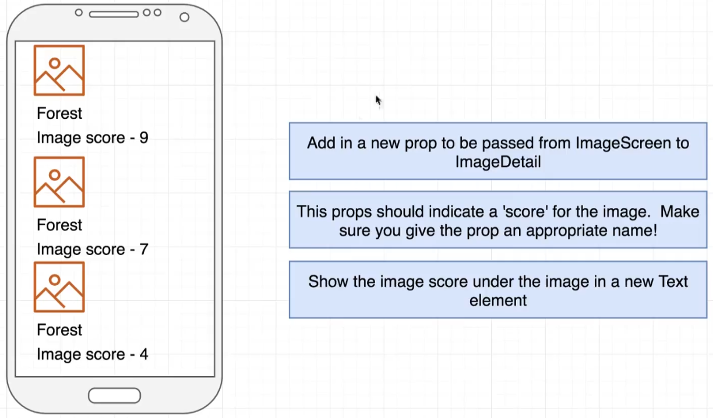

# Criando componentes reutilizáveis
[](./README.md)
[](./README-en.md)

- [Introdução](#introdução)
- [Reuso de componentes com props](#reuso-de-componentes-com-props)
- [Relação entre Pai e Filho](#relação-entre-pai-e-filho)
- [Comunicação do Pai para o Filho](#comunicação-do-pai-para-o-filho)
- [Imagens](#imagens)
- [Mostrando imagens](#mostrando-imagens)
- [Passando imagens como props](#passando-imagens-como-props)
- [Exercício](#exercício)

## Introdução

Neste projeto nós aprenderemos a como criar componentes reutilizáveis. Às vezes nós queremos utilizar o mesmo componente em diferentes partes de um projeto. Neste caso, nós repetir vários blocos de código ou criar um único componente reutilizável.

Sendo assim, nós aprenderemos como construir um componente, comunicar do elemento pai para o elemento filho e passar parâmetros por meio de `props`.

## Reuso de componentes com `props`

Nós utilizaremos as melhores práticas para reutilizar o mesmo bloco de código como componentes.

Neste projeto nós resolveremos o problema ilustrado na figura abaixo. Nós temos um componente que mostra uma imagem e um título
.
<p align="center">
  
</p>

Nós podemos solucionar esse cenário a partir de duas abordagens:
- O mesmo grupo de elementos sendo repetido 3 vezes
- Criar um componente separado

Nós criaremos um componente compartilhado chamado `ImageDetail` com duas props: `title` e `image`.

<p align="center">
  
</p>

## Relação entre Pai e Filho

The reusable components could be created inside [src/components](src/components/) directory. The idea is create a single component that could reused in any screen. We have the [ImageDetail.js](src/components/ImageDetail.js) file inside this folder. This is our component. 

Now we are able to use it in any place of our project. The first thing to do is import the component on the top of the file where we want to use it. We can check this import in [ImageScreen.js](src/screens/ImageScreen.js) file.

## Comunicação do Pai para o Filho

Nós podemos passar parâmetros do componente Pai para o componente Filho a partir de `props`. No componente `Pai`, nós declaramos as propos como um atributo de tag. E, no componente `Filho`, nós obtemos as props como o primeiro argumento da função que define o componente.

Por exemplo:

- `Pai`:
```js
<ImageDetail title="Mountain"/>
```

- `Filho`:
```js
const ImageDetail = (props) => {
  return <Text>{props.title}</Text>
}
```

Neste caso, o componente `Pai` está passando o `title` como uma prop e o `Filho` está recebendo todas as props no argumento `props`.

## Imagens

Neste projeto nós estamos utilizando imagens armazenadas na pasta [assets/img](assets/img). É uma boa prática manter todos os arquivos estáticos dentro da pasta `assets`.

## Mostrando imagens

Nós utilizaremos o componente [Image](https://reactnative.dev/docs/image) do React Native para mostrar as imagens dentro do componente `ImageDetail`.

Esse componente tem a prop `source` que consiste em uma referência de uma imagem. Nós podemos carregar um recurso estático do nosso projeto utilizando a função `require`:

```js
const localImage = require('../../assets/img/beach.jpg')
return <Image source={localImage} style={styles.thumbImage} />
```

Além disso, nós precisamos definir as dimensões da imagem a partir da prop `style`:

```js
const styles = StyleSheet.create({
  thumbImage: {
    width: 50,
    height: 50
  }
})
```

Agora nós podemos passar o nome das imagens como uma prop e renderizá-la dentro do componente `ImageDetail`.

## Passando imagens como props

No componente [ImageScreen](src/screens/ImageScreen.js) nós temos a varia'vel `imageSources` que contém todas as referências das imagens que nós queremos renderizar a partir do componente [ImageDetail](src/components/ImageDetail.js).

Nós criamos a prop `imageSource` como ponto de comunicação com o componente `ImageDetail`. Finalmente, o componente `ImageDetail` utiliza essa prop como fonte do componente `Image` do React Native.

## Exercício

Modifique o projeto atual para renderizar a prop `score` no componente `ImageDetail`.

<p align="center">
  
</p>