# Layout With React Native

- [Introduction](#introduction)
- [Box screen](#box-screen)
- [Align items with Flex](#alignitems-with-flex)
- [Flex direction](#flex-direction)
- [Justify content](#justify-content)

## Introduction

Basically, we have three different layout approaches:

- Box object model
- Flex box
- Position

The image bellow shows a comparison about these three kinds of layout systems:

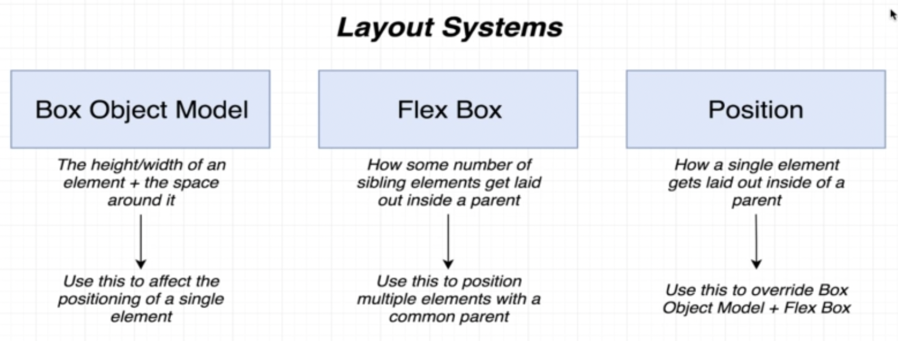

## Box screen

In this project, we have the [BoxScreen.js](src/screens/BoxScreen.js) screen to show the basics about the `Box Object Model`.

This approach is similar than HTML box model. For each object, we have the margin, border, padding and content sections as shown in image bellow:

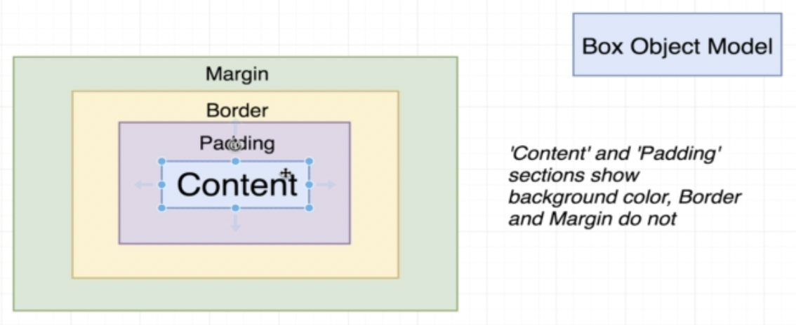

By default, all native elements have margin, borden and padding equals to zero.

We can adjust any part of these settings per sides (`top`, `bottom`, `right` or `left`).

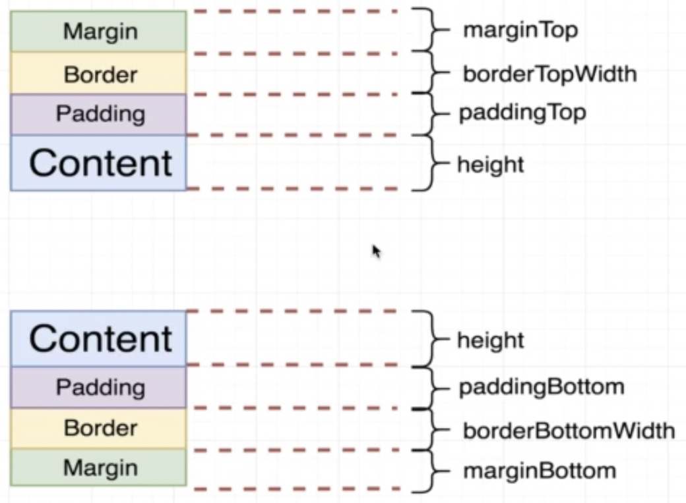

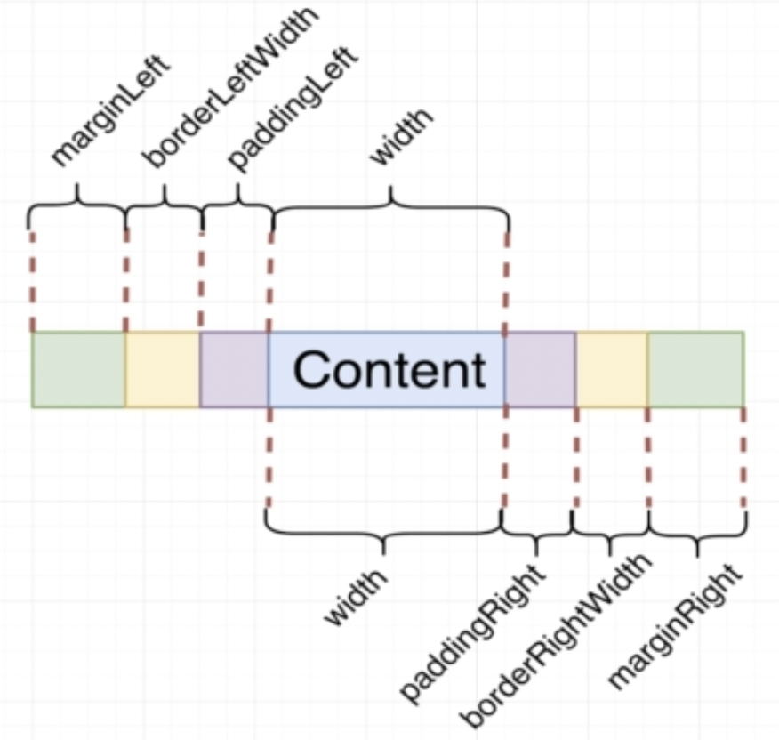

Also, we can use shorcut properties giving the `all sides`, `horizontal` or `vertical` settings.

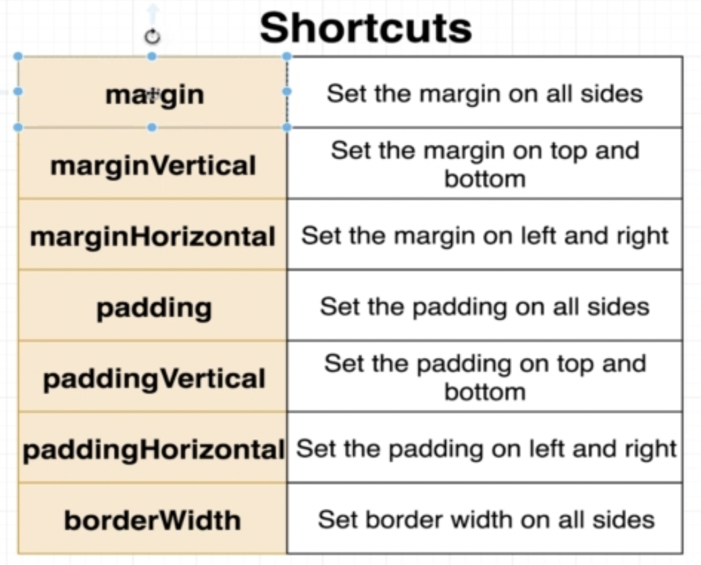

In [BoxScreen.js](src/screens/BoxScreen.js) file we have these properties applied in two components. The first component is a `View` with this properties:

```js
borderWidth: 3,
borderColor: 'black'
```

Also, we have a `Text` object with:

```js
borderWidth: 10,
borderColor: 'red',
margin: 20,
paddingVertical: 10
```

Running this example we can check the spaces mainy in `Text` component. There are different settings for border, margin and padding.

## AlignItems with Flex

We use the Flex Box approach to position multiple elements with a common parent.

The [FlexBoxScreen.js](src/screens/FlexBoxScreen.js) screen is using Flex Box to build de layout of views.

In this file, each `View` have three `Text` components:

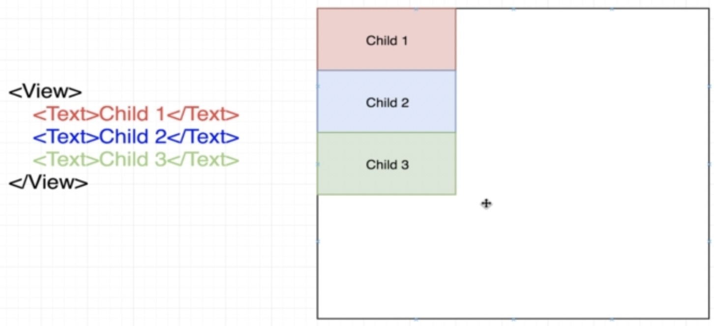

The first `View` (parent view) have the default value for the `alignItems` property. The default value is `'stretch'`.

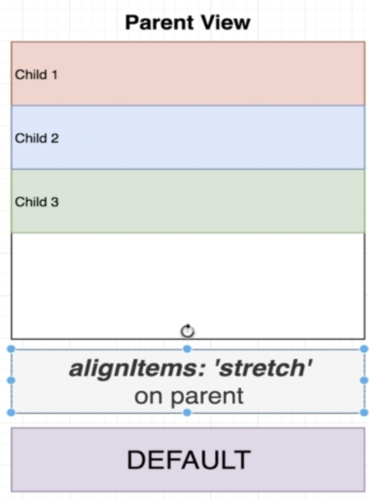

The next `View` have the `alignItems` equals to `flex-start`. It means that each component will keep at the start of container and the `width` is only the required space to render the component content.

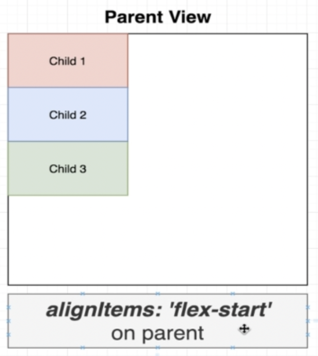

We can use the `center` value for `alignItem`. It will put all elements aligned to the center.

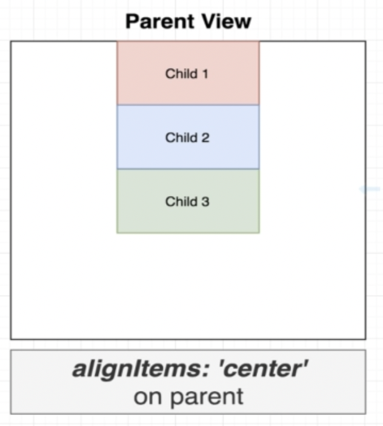

And finally, we use the `flex-end` property to align all children elements at the end of the container.

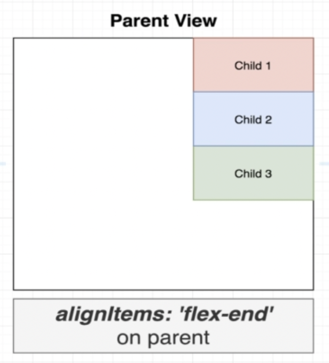

## Flex direction

This property give us control about the elements direction. The elements can be placed vertically (default behavior) or horizontally.

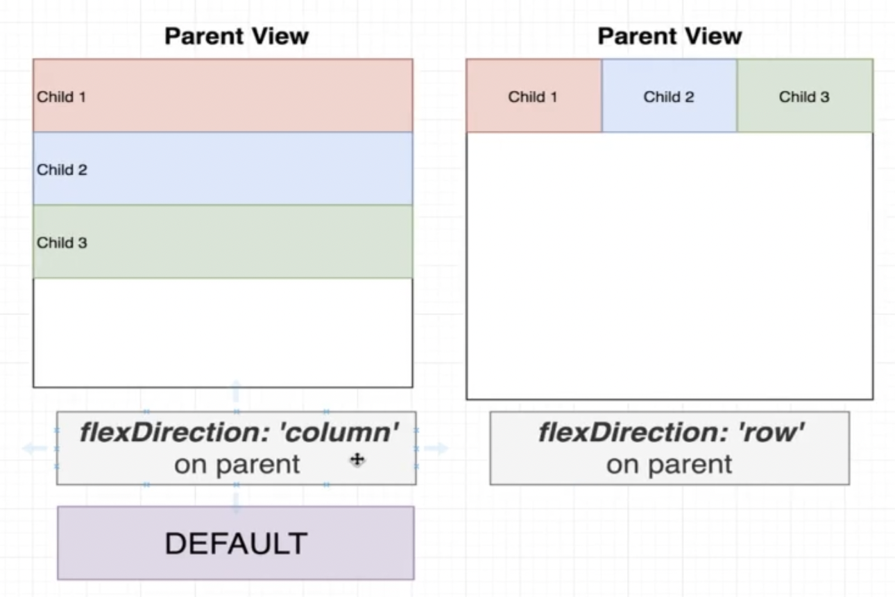

In image above we can check how to use the `flexDirection` property and the two allowed values (`column` or `row`).

We can check this property in the `View` container with `viewStyleRow` style in [FlexBoxScreen.js](src/screens/FlexBoxScreen.js) file.

The `alignItems` will also change the direction reference when we use the `row` value. The image bellow show how `alignitems` is rendered for both `flexDirection` settings.

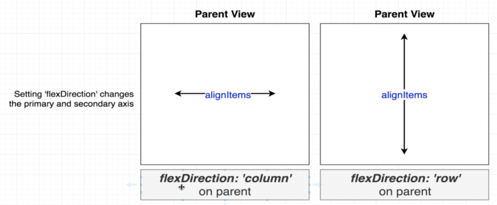

## Justify content