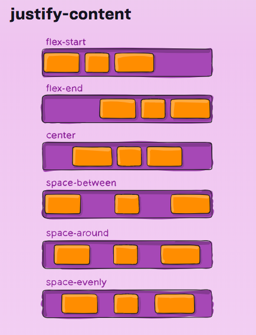
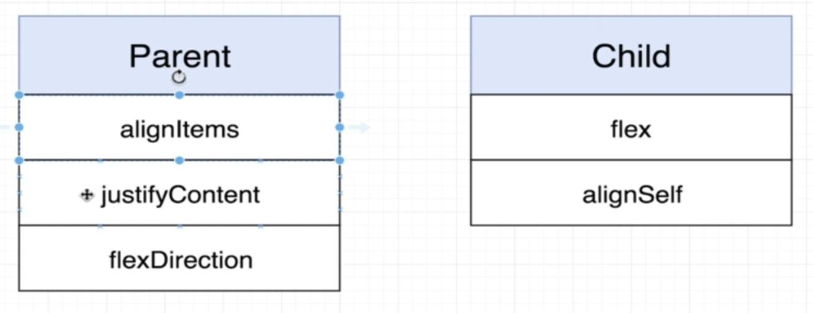
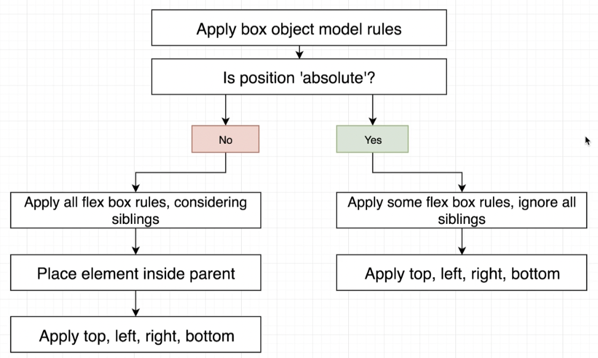
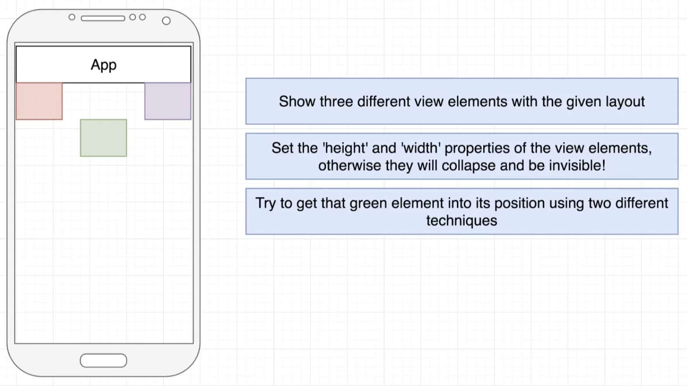

# Layout With React Native
[](./README.md)
[](./README-en.md)

- [Introdução](#introdução)
- [Box screen](#box-screen)
- [Alinhando itens com Flex](#alinhando-itens-com-flex)
- [Flex direction](#flex-direction)
- [Justify content](#justify-content)
- [Flex values](#flex-values)
- [Align Self nos filhos](#align-self-nos-filhos)
- [A propriedade Position](#a-propriedade-position)
- [Top, bottom, left e right](#top-bottom-left-e-right)
- [Aplicando sistemas de layout](#aplicando-sistemas-de-layout)
- [Exercício](#exercício)
- [Referências](#referências)

## Introdução

Basicamente, nós temos três abordagens para a definição de layout:

- Modelo box object
- Flex box
- Position

A imagem abaixo mostra uma comparação entre esses três tipos de sistemas de layout:


## Box screen

In this project, we have the [BoxScreen.js](src/screens/BoxScreen.js) screen to show the basics about the `Box Object Model`.

This approach is similar than HTML box model. For each object, we have the margin, border, padding and content sections as shown in image below:


By default, all native elements have margin, borden and padding equals to zero.

We can adjust any part of these settings per sides (`top`, `bottom`, `right` or `left`).


Also, we can use shorcut properties giving the `all sides`, `horizontal` or `vertical` settings.


In [BoxScreen.js](src/screens/BoxScreen.js) file we have these properties applied in two components. The first component is a `View` with this properties:

```js
borderWidth: 3,
borderColor: 'black'
```

Also, we have a `Text` object with:

```js
borderWidth: 10,
borderColor: 'red',
margin: 20,
paddingVertical: 10
```

Running this example we can check the spaces mainy in `Text` component. There are different settings for border, margin and padding.

## Alinhando itens com Flex

We use the Flex Box approach to position multiple elements with a common parent.

The [FlexBoxScreen.js](src/screens/FlexBoxScreen.js) screen is using Flex Box to build de layout of views.

In this file, each `View` have three `Text` components:


The first `View` (parent view) have the default value for the `alignItems` property. The default value is `'stretch'`.


The next `View` have the `alignItems` equals to `flex-start`. It means that each component will keep at the start of container and the `width` is only the required space to render the component content.


We can use the `center` value for `alignItem`. It will put all elements aligned to the center.


And finally, we use the `flex-end` property to align all children elements at the end of the container.


## Flex direction

This property give us control about the elements direction. The elements can be placed vertically (default behavior) or horizontally.


In image above we can check how to use the `flexDirection` property and the two allowed values (`column` or `row`).

We can check this property in the `View` container with `viewStyleRow` style in [FlexBoxScreen.js](src/screens/FlexBoxScreen.js) file.

The `alignItems` will also change the direction reference when we use the `row` value. The image below show how `alignitems` is rendered for both `flexDirection` settings.


## Justify content

The `justifyContent` layus out children along the primary axis. Primary axis is whatever `flexDirection` is set to.

We have these possible values:

- flex-start
- flex-end
- center
- space-between
- space-around
- space-evenly

The effect of each `justifyContent` value is shown in image below:



In [FlexBoxScreen.js](src/screens/FlexBoxScreen.js) we can check the `View` with the `viewStyleJustifyContent` style. This style have `justifyContent: 'space-evently'` property. It apply the same spaces beetween and outside the elements.

## Flex values

For parent elements we saw the `alignItems`, `justifyContent` and `flexDirection` properties. In this section we will learn about the `flex` and `alignSelf` children properties.



The `flex` property makes a child in a parent to take as much space as possible. This property is also used to set the proportion of each children calculating the sum of `flex` values and giving the relative percentage for each element.

We can see this property in action in `View` element with `` style in  [FlexBoxScreen.js](src/screens/FlexBoxScreen.js) screen.

The two first `Text` elements have the `flexOne` style (`flex: 1 `) and the third element have the `flexTwo` style (`flex: 2`). The total value of `flex` values is 4. It means the first and two elements have 25% of space and the last element 50%.

## Align Self nos filhos

The `alignSelf` property on children essentially overwrites the parent `alignItems` value. So we can deffine the alignment per child.

Check the `View` with `viewStyleStrech` style in [FlexBoxScreen.js](src/screens/FlexBoxScreen.js) file. In this example we applied the `alignSelf: 'center'` property in the second element. 

## A propriedade Position

The `position` allows to set how a single element gets laid out inside of a parent. The default value is `position: 'relative'` and we use the `position: 'absolute'` property to override Box object Model and Flex Box.

In this project we have the [PositionScreen.js](src/screens/PositionScreen.js) to show this layout approach in action.

The second `Text` element inside the `View` have the `position: 'absolute'` value.

## Top, bottom, left e right
The `top`, `bottom`, `left` and `right` properties can be used in any single element to displace it by this reference (absolute or relative). In the [PositionScreen.js](src/screens/PositionScreen.js) we added the `topTen` style to second element. This element is displaced from parent top by 10 pixels.

## Aplicando sistemas de layout

The diagram below give us an idea about when we use each kind of layout system. Note that we can combine them.



## Exercício

Create a new screen with the specifications below:



## Referências
- [Layout with Flexbox](https://reactnative.dev/docs/flexbox)
- [Layout props](https://reactnative.dev/docs/layout-props)
- [Yoga Playground](https://yogalayout.com/playground)
- [The Full React Native Layout Cheat Sheet
](https://medium.com/wix-engineering/the-full-react-native-layout-cheat-sheet-a4147802405c)
- [React Native Styling: Structure for Style Organization](https://thoughtbot.com/blog/structure-for-styling-in-react-native)