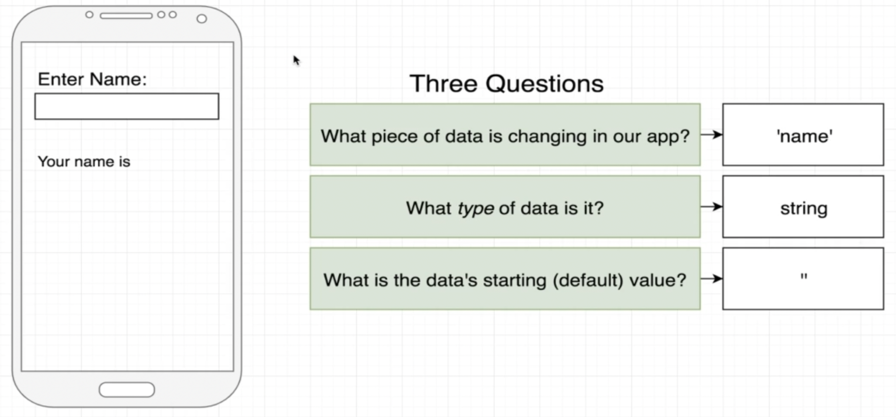
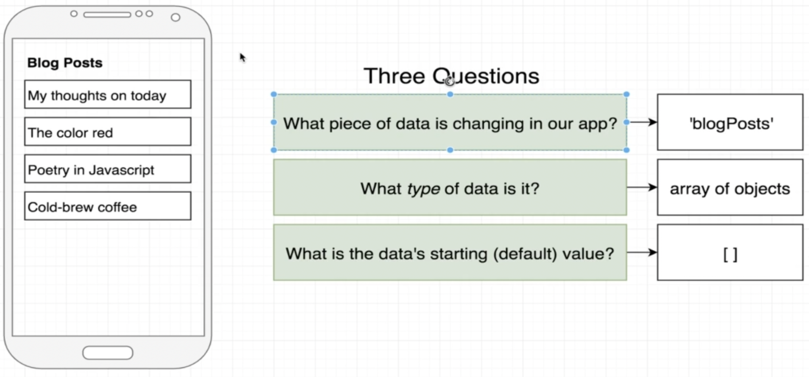
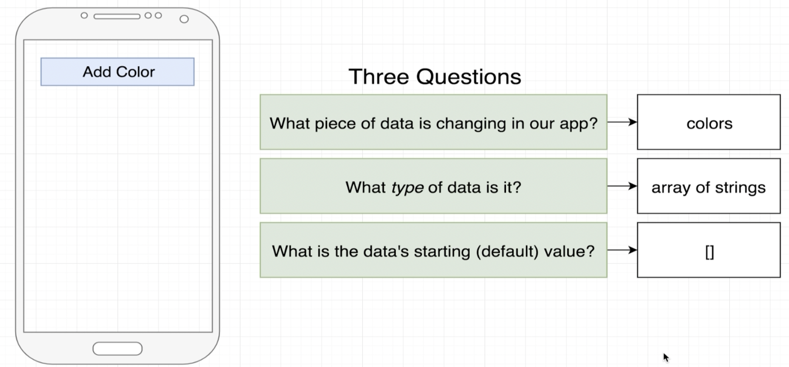
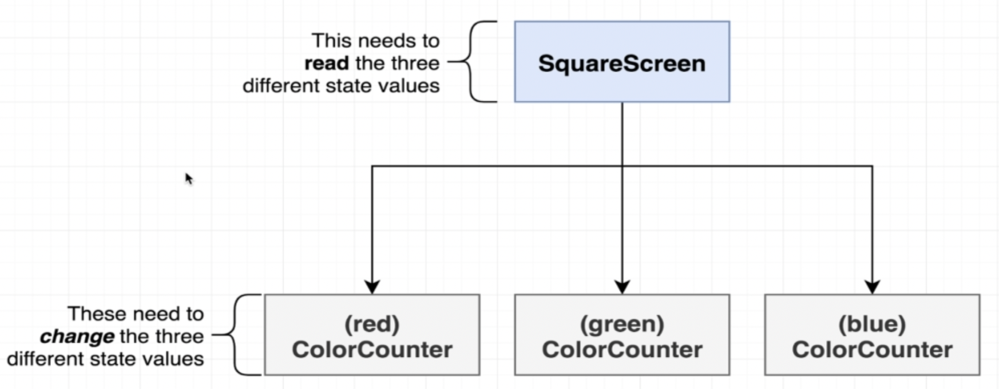

# State Introduction

- [Introduction](#introduction)
- [Screen Counter](#screen-counter)
    - [Planning the state variables](#planning-the-state-variables)
    - [Few notes on state](#few-notes-on-state)
- [Screen Color](#screen-color)
- [Screen Color Mix](#screen-color-mix)
- [References](#references)

## Introduction

In this lesson we will learn about states. States in React are used to re-render the screen content. We can bind state variables as components paramters or to part of an internal logic.

As seen in image below, states are a system to track a piece of data that will change over time. If the data changes, our app will re-render.


In this project we have three projects with that use states variables.

## Screen Counter

This example is relates to [CounterScreenWrong](./src/screens/CounterScreenWrong.js) and [CounterScreen](./src/screens/CounterScreen.js) screens.

It is a simple counter that can be increased or decreased by pressing the related buttons.


The `CounterScreenWrong` implements this feature declaring the `counter` variable and updating this value in `onPress` events.

If you test this screen, you will check it doesn't works. It happens because the screen contet are not binded to variables. React will re-render the screen only for state variables.

So we need to use state variables to reach our goal.

### Planning the state variables

Before start using the state variables, we need to think about the required ones. It is more about strategy and organization, because complex screens may use a lot of state variables and we don't want more complexity to maintain our codebase.

It is a great strategy answer these next three questions:

1. What piece of data is changing in our app?
2. What type of data is it?
3. What is the data's starting (default) value?


For the counter screen we need to update the `current count` value. This type of data can be a `number`. Finally, this value is initiallized as `zero`.

The image below demonstrates the three answers for this problem.


The next example is a screen that shows a name typed in a `TextInput` component and shows this value in a `Text` element.

In this case we need to keep updating the name value. So the state variable is the `name`, this type is a `string` and the initial value is an empty string `''`.



The last example is a screen that reads a collection of blog posts from a data source. Since it is a dynamic data, we need to update the `blogPosts` as an `array` type. Also we can initialize as an empty array `[]`.



### Few notes on state

- We are using function-based state in a functional component. React also has class-based components that have access to [state](https://reactjs.org/docs/faq-state.html).
- We *never* directly modify a state variable. React doesn't detect this change! Only use the `setter` function.
- We can name the state variable anything we wish.
- We can track any kind of data that changes over time - a number, string, array of ojects, etc.
- When a component is rerendered, *all of its children get rerendered too*.
- A state variable can be passed to a child component! At that point, the state variable is now being used as `props`.

## Screen Color

In the [ColorScreen](./src/screens/ColorScreen.js) we are creating random colors by pressing the `Add Color` button.


Here we need the to update the `colors` value. So we will use an `array of strings` as state variable with an empty array as default value.



In [ColorScreen](./src/screens/ColorScreen.js) we need to pay attention at some lines of code.

First of all, we need to import the `useState` Hook. According to [React documentation](https://reactjs.org/docs/hooks-state.html#whats-a-hook): 

> A Hook is a special function that lets you "hook into" React features. For example, `useState` is a Hook that lets you add React state to function components.

The next step is declare the state variable and his setter function. In the code line below we have the `colors` variable and the `setColors` setter function. 

The default value is passed as an argument of `useState` function call.

```js
const [colors, setColors] = useState([])
```

We have to call the `setColors` function to update the `colors` state variable. Here is an example to put elements into `colors` state variable:

```js
setColors(['red', 'green', '#0a03ff'])
```

After call this function, the screen will rerender assuming the `['red', 'green', '#0a03ff']` is assigned to `colors` value.

So in [ColorScreen](./src/screens/ColorScreen.js) we are adding a new `rgb` color into `colors` by pressing the `Add Color` button.

The auxliary `randomRgb` function is called in `onPress` event and returns a random color.

Finally, the `FlatList` element points to `colors` as a data source. This component renders a `View` with the random `backgroundColor` and a `Text` showing the color value.

## Screen Color Mix

The [ColorMixScreen](./src/screens/ColorMixScreen.js) is our third example that shows how to plan and use states in a complex point of view.

In this screen we are building our color configuring the amount of `red`, `green` and `blue`. 


Answering the three main questions, we have to update the data by each color component. So, we will have the `red`, `green` and `blue` state variables.

These variables are `number` and the initial value is `255`.


We have the [ColorCounter](./src/components/ColorCounter.js) component to avoid ambiguous code. This component have the callbacks for `Increase` and `Decrease` actions.

Now we can start to think where should we have to create the state variables? In screen or component?





Callbacks

## References
- [Using the State Hook](https://reactjs.org/docs/hooks-state.html)