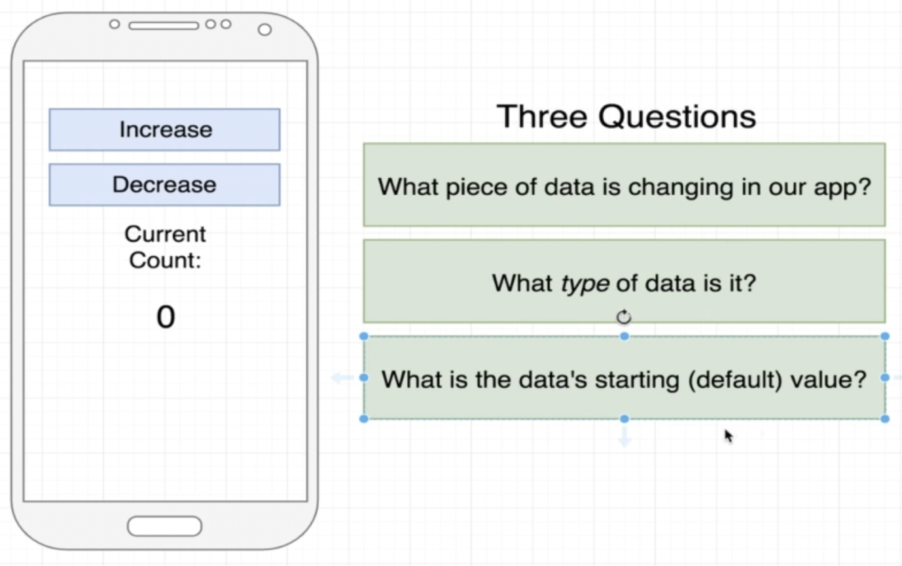
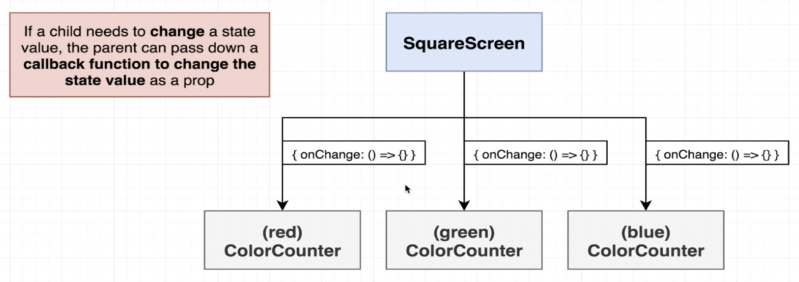

# State Introduction

- [Introduction](#introduction)
- [Screen Color](#screen-color)
- [Screen Color Mix](#screen-color-mix)
- [References](#references)

## Introduction

## Screen Color

## Screen Color Mix

Where do we have to create the state variables?

Callbacks

## References
- [Using the State Hook](https://reactjs.org/docs/hooks-state.html)