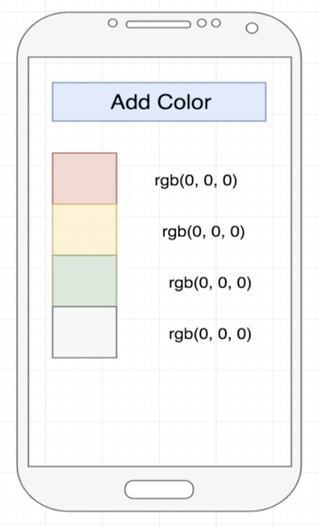
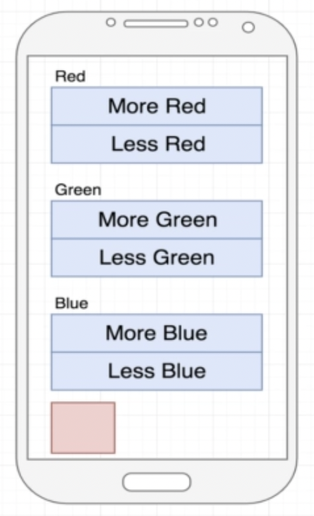
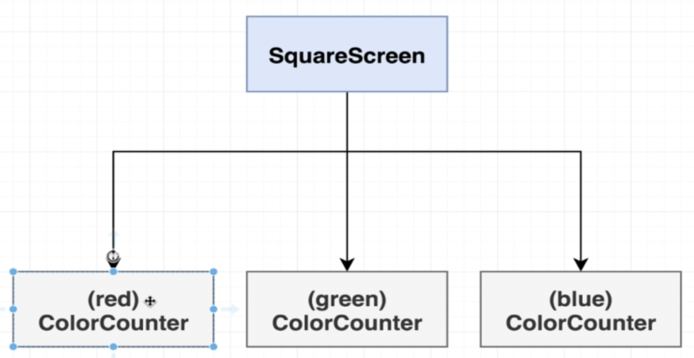

# State Introduction

- [Introduction](#introduction)
- [Screen Counter](#screen-counter)
- [Screen Color](#screen-color)
- [Screen Color Mix](#screen-color-mix)
- [References](#references)

## Introduction

In this lesson we will learn about states. States in React are used to re-render the screen content. We can bind state variables as components paramters or to part of an internal logic.

As seen in image bellow, states are a system to track a piece of data that will change over time. If the data changes, our app will re-render.

In this project we have three projects with that use states variables.

## Screen Counter

This example is relates to [CounterScreenWrong](./src/screens/CounterScreenWrong.js) and [CounterScreen](./src/screens/CounterScreen.js) screens.

It is a simple counter that can be increased or decreased by pressing the related buttons.

The `CounterScreenWrong` implements this feature declaring the `counter` variable and updating this value in `onPress` events.

## Screen Color

## Screen Color Mix

Where do we have to create the state variables?

Callbacks

## References
- [Using the State Hook](https://reactjs.org/docs/hooks-state.html)