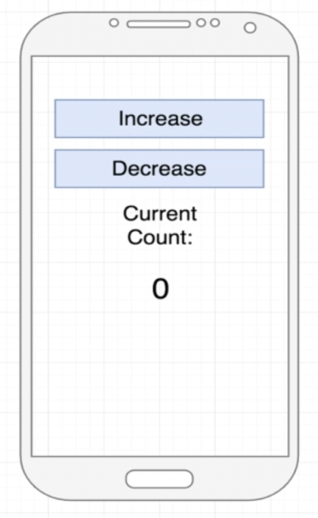

# Introdução a estado
[](./README.md)
[](./README-en.md)

- [Introdução](#introdução)
- [Counter Screen](#counter-screen)
    - [Planejando as variáveis de estado](#planejando-as-variáveis-de-estado)
    - [Algumas observações sobre estado](#algumas-observações-sobre-estado)
- [Color Screen](#color-screen)
- [Color Mix Screen](#color-mix-screen)
- [Utilizando Reducer para gerenciar o estado](#using-reducer-to-manage-state)
- [Exercício](#exercício)
- [Referências](#referências)

## Introdução

Nesta lição aprenderemos sobre estados. Os estados no React são usados para renderizar novamente o conteúdo da tela. Podemos vincular variáveis de estado como parâmetros de componentes ou como parte de uma lógica interna.

Como pode ser visto na imagem abaixo, os estados são um sistema para rastrear dados que mudam com o tempo. Se os dados mudarem, nosso aplicativo será renderizado novamente.


Neste projeto temos três projetos que utilizam variáveis de estados.

## Counter Screen

Este exemplo está relacionado às telas [CounterScreenWrong](./src/screens/CounterScreenWrong.js) e [CounterScreen](./src/screens/CounterScreen.js).

É um contador simples que pode ser aumentado ou diminuído pressionando os botões relacionados.



O `CounterScreenWrong` implementa este recurso declarando a variável `counter` e atualizando este valor em eventos `onPress`.

Se você testar esta tela, verificará que não funciona. Isso acontece porque o conteúdo da tela não está vinculado a variáveis. O React renderizará novamente a tela apenas para variáveis de estado.

Portanto, precisamos usar variáveis de estado para atingir nosso objetivo.

### Planejando as variáveis de estado

Antes de começar a usar as variáveis de estado, precisamos pensar nas necessárias. É mais uma questão de estratégia e organização, porque telas complexas podem usar muitas variáveis de estado e não queremos mais complexidade para manter nossa base de código.

É uma ótima estratégia responder às próximas três perguntas:

1. Que dados estão mudando em nosso aplicativo?
2. Que tipo de dados são?
3. Qual é o valor inicial (padrão) dos dados?


Para a tela do contador, precisamos atualizar o valor da `current count`. Este tipo de dado pode ser um `number`. Finalmente, este valor é inicializado como `zero`.

A imagem abaixo demonstra as três respostas para este problema.


O próximo exemplo é uma tela que mostra um nome digitado em um componente `TextInput` e mostra esse valor em um elemento `Text`.

Neste caso, precisamos continuar atualizando o valor do nome. Portanto a variável de estado é o `name`, este tipo é uma `string` e o valor inicial é uma string vazia `''`.


O último exemplo é uma tela que lê uma coleção de postagens de blog de uma fonte de dados. Por se tratar de dados dinâmicos, precisamos atualizar o `blogPosts` como um tipo `array`. Também podemos inicializar como um array vazio `[]`.


### Algumas observações sobre estado

- Estamos usando estado baseado em função em um componente funcional. O React também possui componentes baseados em classes que têm acesso ao [estado](https://reactjs.org/docs/faq-state.html).
- Nós *nunca* modificamos diretamente uma variável de estado. O React não detecta essa mudança! Use apenas a função `setter`.
- Podemos nomear a variável de estado como quisermos.
- Podemos rastrear qualquer tipo de dado que mude ao longo do tempo - um número, string, array de objetos, etc.
- Quando um componente é renderizado novamente, *todos os seus filhos também são renderizados novamente*.
- Uma variável de estado pode ser passada para um componente filho! Nesse ponto, a variável state agora está sendo usada como `props`.

## Color Screen

No [ColorScreen](./src/screens/ColorScreen.js) estamos criando cores aleatórias pressionando o botão `Add Color`.


Aqui precisamos atualizar o valor `colors`. Portanto, usaremos um `array de strings` como variável de estado com um array vazio como valor padrão.


Em [ColorScreen](./src/screens/ColorScreen.js) precisamos prestar atenção em algumas linhas de código.

Primeiro de tudo, precisamos importar o hook `useState`. De acordo com a [documentação do React](https://reactjs.org/docs/hooks-state.html#whats-a-hook):

> Um Hook é uma função especial que permite "conectar-se" aos recursos do React. Por exemplo, `useState` é um gancho que permite adicionar o estado React aos componentes da função.

O próximo passo é declarar a variável de estado e sua função setter. Na linha de código abaixo temos a variável `colors` e a função setter `setColors`.

O valor padrão é passado como um argumento da chamada da função `useState`.

```js
const [colors, setColors] = useState([])
```

Temos que chamar a função `setColors` para atualizar a variável de estado `colors`. Aqui está um exemplo para colocar elementos na variável de estado `colors`:

```js
setColors(['red', 'green', '#0a03ff'])
```

Após chamar esta função, a tela será renderizada novamente assumindo que `['red', 'green', '#0a03ff']` seja atribuído ao valor `colors`.

Portanto, em [ColorScreen](./src/screens/ColorScreen.js) estamos adicionando uma nova cor `rgb` em `colors` pressionando o botão `Add Color`.

A função auxiliar `randomRgb` é chamada no evento `onPress` e retorna uma cor aleatória.

Finalmente, o elemento `FlatList` aponta para `colors` como fonte de dados. Este componente renderiza um `View` com o `backgroundColor` aleatório e um `Text` mostrando o valor da cor.

## Color Mix Screen

O [ColorMixScreen](./src/screens/ColorMixScreen.js) é nosso terceiro exemplo que mostra como planejar e usar estados em um ponto de vista complexo.

Nesta tela estamos construindo nossa cor configurando a quantidade de `red`, `green` e `blue`.


Respondendo às três questões principais, temos que atualizar os dados por cada componente de cor. Assim, teremos as variáveis de estado `red`, `green` e `blue`.

Essas variáveis ​​são `number` e o valor inicial é `255`.


Temos o componente [ColorCounter](./src/components/ColorCounter.js) para evitar código ambíguo. Este componente possui retornos de chamada para ações `Increase` e `Decrease`.

Agora podemos começar a pensar onde devemos criar as variáveis de estado? Em tela ou componente?


Geralmente, criamos variáveis de estado no componente pai que precisa ler ou alterar um valor de estado.


Neste exemplo, estamos passando uma função de retorno de chamada como `prop` para alterar o estado do componente de cor.


Em [ColorMixScreen](./src/screens/ColorMixScreen.js) passamos os retornos de chamada `onIncrease` e `onDedrease` para atualizar o componente de cor atual. Além disso, passamos o componente color nos adereços `color` apenas para mostrar o rótulo da cor ao usuário.

```js
<ColorCounter
    onIncrease={() => setColor(blue, COLOR_INCREMENT, setBlue)}
    onDecrease={() => setColor(blue, -1 * COLOR_INCREMENT, setBlue)}
    color='Blue'
/>
```

A função `setColor` valida o ajuste de cor porque o intervalo de cada componente de cor deve estar entre `0` e `255`. Quando o novo valor do componente de cor é permitido, atualizamos o estado do componente de cor com o novo valor.

## Utilizando Reducer para gerenciar o estado

Reducer is a hook that allow us to manage a state in a function. The [ColorMixReducerScreen](./src/screens/ColorMixReducerScreen.js) is a refactored version of the previous example.

### Quick Thoughts
1. App workgs right now - we could leave it as is! But we could make it slightly better...
2. We have three separate pieces of state
3. For this app, these three pieces of state are extremely related*
4. There is a precise set of well-known ways in which we update these values*

`*`: This makes our state a great candidate for being managed by a `reducer`.

### Reducer - function that manages changes to an object!?!?
- Real fancy name
- Function that gets called with two objects
- Argument 1 - Object that has all of our state in it
- Argument 2 - Object that describes the update we want to make
- We look at ARgument 2 and use it to decide how to change Argument 1
- Two technicalities
    1. We never change Argument 1 directly.
    2. We must always return a value to be used as Argument 1

Refactoring `ColorMixScreen`:
- Remove state references
- Delete `setColor` function
- Import `useReducer`
```js
import React, { useReducer } from 'react'
```
- Declare a new reducer
```js
const [state, dispatch] = useReducer(reducer, { red: 255, green: 255, blue: 255 })
```
- Implement the `reducer` function
```js
const reducer = (state, action) => {
  // state === { red: number, green: number, blue: number }
  // action === { type: 'red' || 'green' || 'blue', payload: 15 || -15 }
  const { type, payload } = action
  const currentColorValue = state[type]

  if (currentColorValue + payload <= 255 && currentColorValue + payload >= 0) {
    const newState = { ...state }
    newState[type] = currentColorValue + payload
    return newState
  } else {
    return state
  }
}
```
- Update `ColorCounter` increase/decrease actions
```js
<ColorCounter
  onIncrease={() => dispatch({ type: 'red', payload: COLOR_INCREMENT })}
  onDecrease={() => dispatch({ type: 'red', payload: -1 * COLOR_INCREMENT })}
  color='Red'
/>
```

## Exercício

1. Refactor `CounterScreen` replacing `useState` to `useReducer` hook.

## Referências
- [State: A Component's Memory](https://react.dev/learn/state-a-components-memory)
- [useState Hook](https://react.dev/reference/react/useState)
- [useReducer Hook](https://react.dev/reference/react/useReducer)