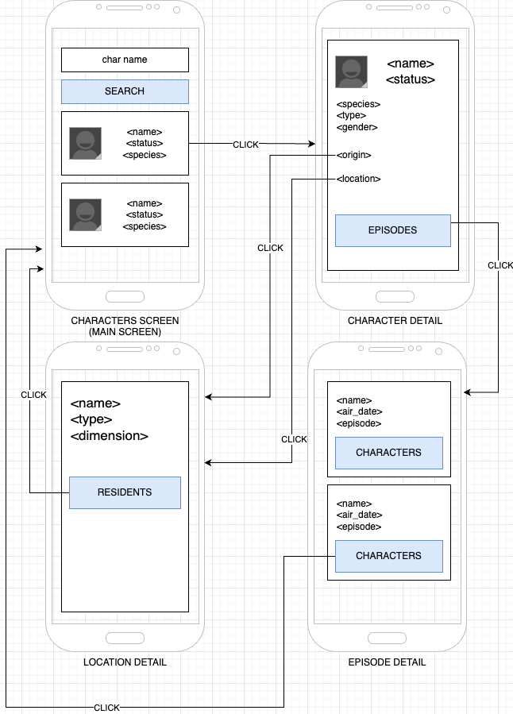

# Consuming a REST API

## useState's Second Argument
- `useState(() => {})`: Run the arrow function **every time** the component is rendered
- `useState(() => {}, [])`: Run the arrow function **only** when the component is **first** rendered
- `useState(() => {}, [value])`: Run the arrow function **only** the component is **first** rendered, **and** when the `value` **changes**.

Check [rick-and-morty](./src/component/api/rick-and-morty/index.js) API client for an example.

## Exercise

Improve the project of this codebase with additional features and screens according to mock bellow:

## References
### HTTP calls
- [Promise](https://developer.mozilla.org/pt-BR/docs/Web/JavaScript/Reference/Global_Objects/Promise)
- [async function](https://developer.mozilla.org/en-US/docs/Web/JavaScript/Reference/Statements/async_function)
- [await operator](https://developer.mozilla.org/en-US/docs/Web/JavaScript/Reference/Operators/await)
- [Axios](https://axios-http.com/ptbr/docs/intro)

### useEffect
- [useEffect](https://react.dev/reference/react/useEffect)
- [Synchronizing with Effects](https://react.dev/learn/synchronizing-with-effects)
- [You Might Not Need an Effect](https://react.dev/learn/you-might-not-need-an-effect)

### API
- [Rick and Morty API - Documentation](https://rickandmortyapi.com/documentation)
- [API Rank](https://apirank.dev/)