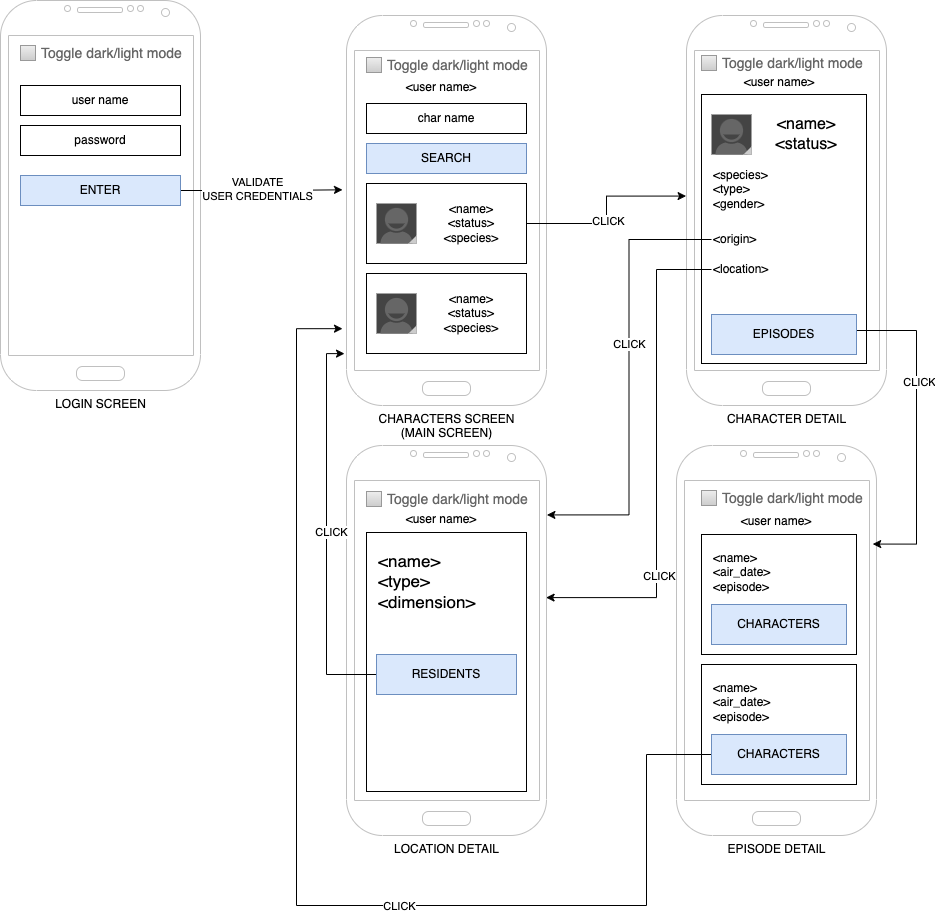

# useContext Hook
[](./README.md)
[](./README-en.md)

- [Introduction](#introduction)
- [useContext](#usecontext)
  - [Structure of the example project](#structure-of-the-example-project)
  - [The context default value](#the-context-default-value)
  - [Updating the context](#updating-the-context)
  - [Caveats](#caveats)
- [Exercise](#exercise)
- [References](#references)

## Introduction

This hook allows you to read and subscribe to context from your React component. It solves the *prop drilling* problem: passing the same piece of data through several components that do not use it, only to deliver it to a component deep in the tree.

We read a context by calling `useContext` at the top level of our components:

```js
import { useContext } from 'react'

const MyComponent = () => {
  const context = useContext(SomeContext)
  // ...
}
```

We need to create a context above the component using the [createContext](https://react.dev/reference/react/createContext) function.

## useContext

To use a context, remember to:

1. Create a context with the `createContext` function.
2. Add a provider **above** the components that will use the context.
3. Call the `useContext` hook inside the component to retrieve the context value.

> **React 19:** starting with this version the context itself works as the provider — `<MyContext value={value}>`. The old form, `<MyContext.Provider value={value}>`, still works but is being deprecated. This project uses React 19 and adopts the new form.

### Structure of the example project

In this project we can check how Context is applied in these files:

- [ThemeContext](./src/contexts/ThemeContext.js): creates the context with `createContext` and defines the `ThemeProvider` component, which holds the theme state.
- [App](./App.js): puts the `ThemeProvider` **above** the `NavigationContainer`, so that **every** screen can see the context.
- [MenuScreen](./src/screens/MenuScreen.js) and [ThemeScreen](./src/screens/ThemeScreen.js): screens that read **and** change the theme, without receiving any prop for that.
- [Form](./src/components/Form.js): component that consumes the `ThemeContext` with the `useContext` hook.

Note that the context lives in its own file (`src/contexts`). Declaring the context inside a screen and importing it from a component creates unnecessary coupling and makes import cycles easy to hit.

### The context default value

The argument of `createContext` is the value used **only** when a component calls `useContext` with no provider above it in the tree. It is not the provider's initial value:

```js
export const ThemeContext = createContext({
  theme: 'light',
  toggleTheme: () => { }
})
```

If a provider exists above, its value is the one that counts — the default is ignored.

### Updating the context

A context is not read-only. To let any component change the value, keep the state in the provider and publish **the value and the function that changes it** together:

```js
export const ThemeProvider = ({ children }) => {
  const [theme, setTheme] = useState('dark')

  const toggleTheme = () => {
    setTheme((currentTheme) => currentTheme === 'dark' ? 'light' : 'dark')
  }

  return (
    <ThemeContext value={{ theme, toggleTheme }}>
      {children}
    </ThemeContext>
  )
}
```

Consumers get both:

```js
const { theme, toggleTheme } = useContext(ThemeContext)
```

### Caveats

From the [React documentation](https://react.dev/reference/react/useContext#caveats):
> - The provider needs to be **above** the component doing the `useContext` call. A component never reads the context from a provider declared in itself.
> - React automatically re-renders all the children that use a particular context starting from the provider that receives a different value.
> - Passing something via context only works if the `SomeContext` that you use to provide context and the `SomeContext` that you use to read it are exactly the same object, as determined by a `===` comparison.

## Exercise

Update your [Rick and Morty App](../08-consuming-a-rest-api/README-en.md#exercises) with the new structure below:



You should implement two contexts. The first one stores the user name. The second one controls the applied theme.

We must be able to toggle the theme between light and dark on any screen, and show the user name on the screens after login. Use the [CheckBox](https://reactnative.dev/docs/checkbox.html) component to toggle the theme.

Hints:
- Put both providers in `App.js`, above the `NavigationContainer`.
- Each context should live in its own file under `src/contexts`.
- Don't forget to update the styles for both themes.

## References
- [useContext documentation](https://react.dev/reference/react/useContext)
- [createContext documentation](https://react.dev/reference/react/createContext)
- [Passing Data Deeply with Context](https://react.dev/learn/passing-data-deeply-with-context)
- [Scaling Up with Reducer and Context](https://react.dev/learn/scaling-up-with-reducer-and-context)
- [CheckBox component](https://reactnative.dev/docs/checkbox.html)
