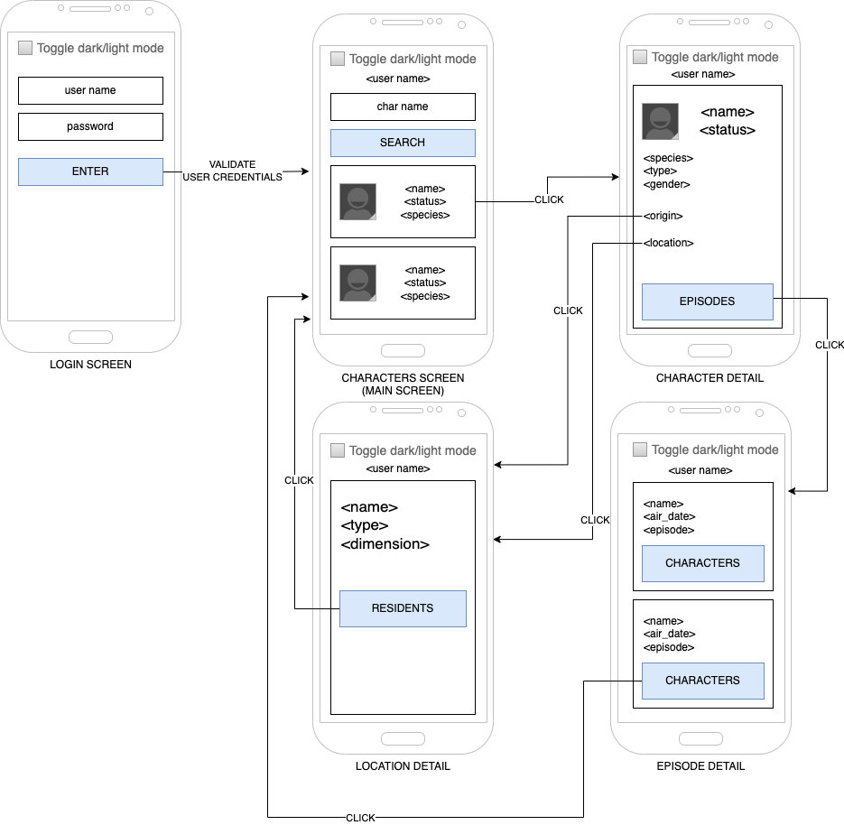

# useContext Hook

- [Introduction](#introduction)
- [useContext](#useContext)
- [Exercise](#exercise)
- [References](#references)

## Introduction

This hook allows you to read and subscribe to context from your React component. We can read and subscribe to a context by calling `useContext` at the top level of our components:

```js
import { useContext } from 'react';

const MyComponent = () => {
  const context = useContext(SomeContext);
  // ...
}
```

We need to create a context above the component using the [createContext](https://react.dev/reference/react/createContext) function.

## useContext
Lorem
### Caveats
From [React documentation](https://react.dev/reference/react/useContext#caveats):
> - The `Context.Provider` needs to be **above** the component doing `useContext` call.
> - React automatically re-renders all the children that use a particular context starting from the provider that receives a different value.
> - Passing something via context only works if `SomeContext` that you use to provide context and `SomeContext` that you use to read it are exactly the same object, as determined by a `===` comparison.

## Exercise

Update your [Rick and Morty App](../08-consuming-a-rest-api/README.md#exercise) with new structure bellow:



You should implement two contexts. First context is to store user name. The second is used to control the applied theme.

We can toggle the theme to dark or light in any screen and we should show the user name in next screens after logon.

Dont't forget to update the styles for both themes.

## References
- [useContext documentation](https://react.dev/reference/react/useContext)
- [createContext documentation](https://react.dev/reference/react/createContext)