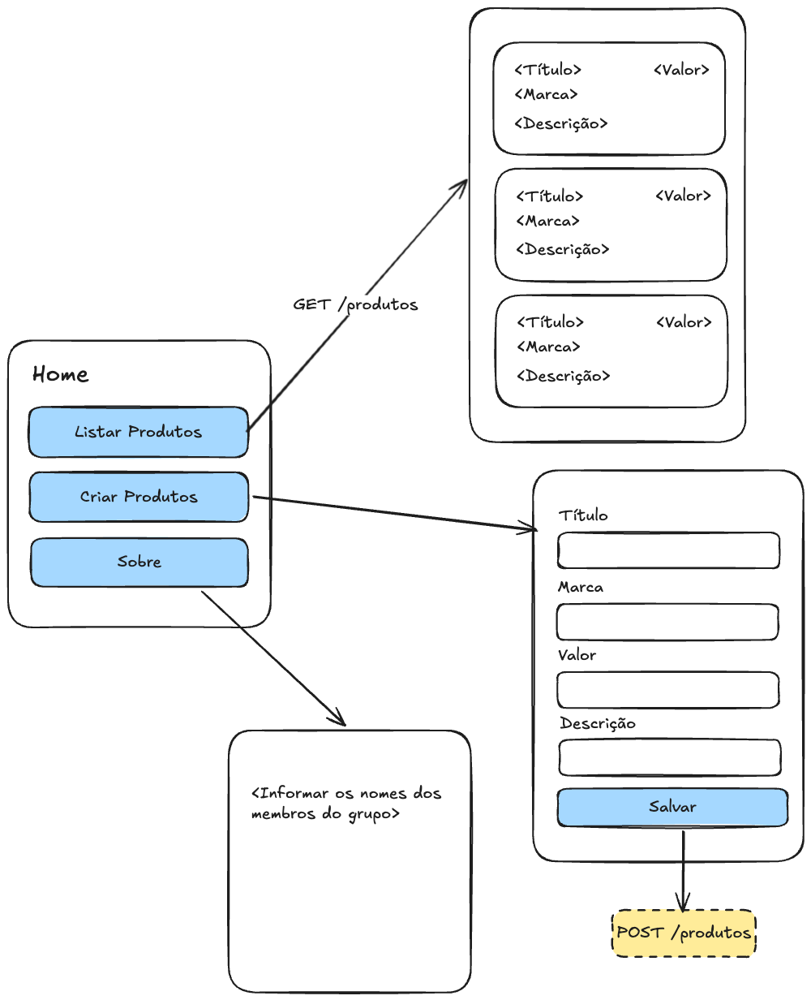

# Integração de API com backend

## Como executar o projeto

### Backend

1. Instalar as dependências do backend

```bash
cd backend
npm install
```

2. Executar o backend

```bash
npm run dev
```

### Frontend

1. Instalar as dependências do frontend

```bash
cd frontend
npm install
```

2. Executar o frontend

```bash
npm run web
```


## Atividade

### Backend

Criar uma API para gerenciar a tabela `produto`.

A tabela `produto` tem os seguintes campos:

- `id` (inteiro, chave primária, autoincremento)
- `titulo` (varchar de tamanho máximo 255, obrigatório)
- `descricao` (texto, não obrigatório)
- `valor` (decimal, obrigatório)

Crie o arquivo `backend/sql/produto.sql` com o comando para criar a tabela `produto`. Além disso, adicione 10 registros na tabela produto a partir do arquivo `backend/sql/produtosData.sql`.

A API deve ter as seguintes rotas:

- GET /produtos (retorna todos os produtos do banco de dados)
- POST /produtos (cria um novo produto no banco de dados)

### Frontend

Crie um aplicativo em React Native que permite gerenciar os produtos.

O aplicativo deve ter as seguintes telas:

- Tela de listagem de produtos
- Tela de criação de produto
- Sobre o aplicativo com as informações dos autores

O aplicativo deve ter o layout bem definido, com cores e fontes consistentes.

Utilize o esquema do protótipo a seguir para criar o aplicativo:

<div style="display: flex; justify-content: center;">
  
</div>